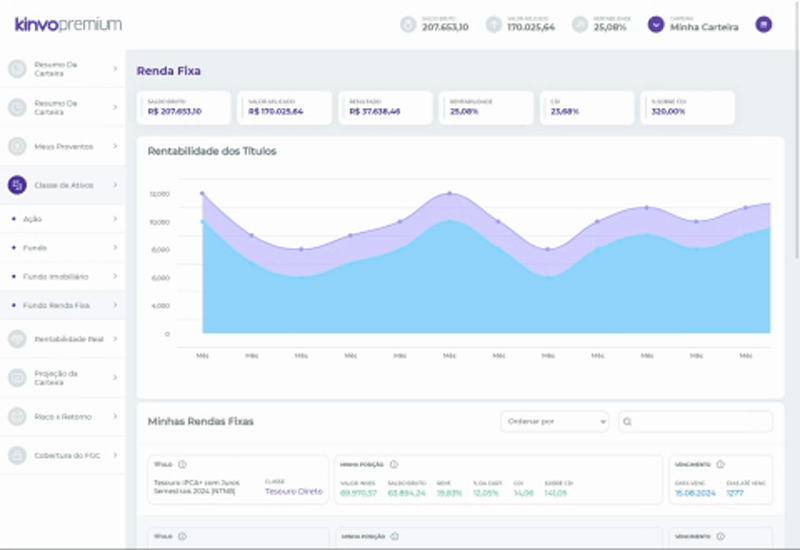

# About the Project

Project developed for Kinvo Front-End Web Developer vacancy.

The following resources were charged for this project:

• Allow filtering of products in the "Minhas Rendas Fixas" section from searches performed in the text field.

• Display real data obtained from the API https://1762dd35-8f53-49fd-8b8e-c8134a283cb4.mock.pstmn.io/getFixedIncomeClassData.

• Page products (5 per page) in the "Minhas Rendas Fixas" section.

• Use of the React library.

• Use of the Styled Components libary.

• Allow set order of products section "Minhas Rendas Fixas" from the selector menu.

## ⚙️ About the App (dependencies)

• This project was built with [Create React App](https://github.com/facebook/create-react-app).

• Use [styled-components](https://styled-components.com/) library.
"npm install --save styled-components"

• Use [Highcharts](https://www.highcharts.com/) library for the graphs.
"npm install highcharts highcharts-react-official"

## 🛠️ Development server

• Clone this repository "https://github.com/codigosdowill/kinvo-front-end-test.git" (remember to access the correct branch)

• Run `npm install` to add "node_modules" in project directory.

• Run `npm start` for a dev server.

• Open [http://localhost:3000](http://localhost:3000) to view it in the browser.

thanks. ✌️