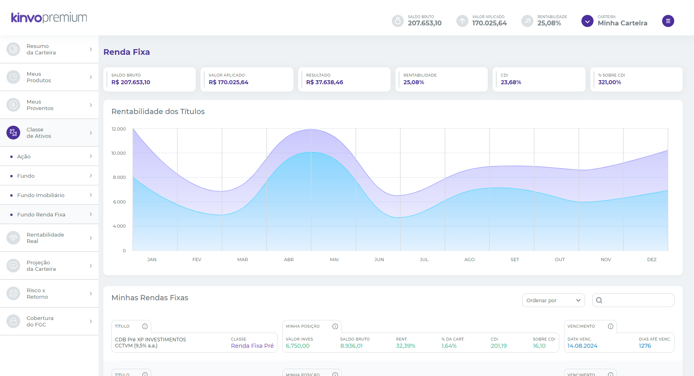

# **Kinvo**premium | Desafio Técnico Kinvo

Esse projeto é fruto do desafio técnico front-end da [Kinvo](https://www.kinvo.com.br/)

## Descrição

O desafio exigia que fosse implementada a página **Classe de Ativos > Fundo Renda Fixa** da plataforma Kinvo Premium.

## Requisitos (Pleno)

- Permitir a filtragem de produtos na seção Minhas Rendas Fixas a partir de buscas realizadas no campo de texto
- Exibir dados reais obtidos a partir da API `https://1762dd35-8f53-49fd-8b8e-c8134a283cb4.mock.pstmn.io/getFixedIncomeClassData`
- Paginar produtos (5 por página) na seção **Minhas Rendas Fixas**
- Fazer uso da biblioteca [React](https://pt-br.reactjs.org/)
- Fazer uso da biblioteca [Styled Components](https://styled-components.com/)
- Permitir ordenação de produtos seção Minhas Rendas Fixas a partir do menu seletor

## Instruções para Executar o Projeto

Faça o _download_ do repositório em sua máquina e abra um terminal no escopo do diretório raíz do projeto.

No terminal, rode o seguinte comando:

`...\desafio-kinvo-premium> yarn`

Ele irá instalar as dependências do projeto. Após finalizadas todas as instalações, rode:

`...\desafio-kinvo-premium> yarn start`

A partir daí, a aplicação poderá ser vista no seu _browser_ no [localhost:3000](http://localhost:3000/).

 
 

## Contato

### **Lucas Rezende | Desenvolvedor _Front-end_**

 +55 (71) 9 9342-8942

 lucas.s.oliveira.rezende@gmail.com

 [LinkedIn](https://www.linkedin.com/in/lucas-rezende-b155a01b3/)

 [GitHub](https://github.com/oLucasRez)
