> 

# Teste candidatos à vaga de Front-End **ainda em andamento** por Danilo Alves

## Instruções para rodar o aplicativo:
Primeiro, é necessário estar dentro da pasta kinvo-teste, que fica em<br>
```kinvo-front-end-test/kinvo-teste```
Após estar dentro da pasta (pelo terminal), pode ser inicializado em modo desenvolver através do comando:<br>
```npm start``` 
Com isso, ficará disponível para ser visto em [http://localhost:3000](http://localhost:3000). <br>
Caso desejado, a versão final do aplicativo pode ser construído com: <br>
```npm build``` <br>
Logo em seguida a build contará com otimizações e estará minificada.

### Ferramentas usadas:

- React JS;
- Javascript;
- HTML;
- styled-components;
- CSS;
- *Obs.* Foi utilizado também a API disponibilizada.

## Organização dos Componentes
Segue uma breve explicação sobre cada um dos componentes.

### FunctionsLibrary.jsx
Contêm funções que utilizadas ao longo da criação dos componentes, tais como
`styleMoney` que é para formatar os números para dinheiro, `sortedUpperProducts` para transformar os nomes dos 
produtos para maiúsculo e ordená-los crescentemente, etc.

### FundsProduct.jsx
Produto que carrega consigo seu nome, saldo atual, quantidade, última cotação, yield mensal, yield anual 
e sua porcentagem na carteira. Esse é um dos componentes mais básicos na aplicação.<br>

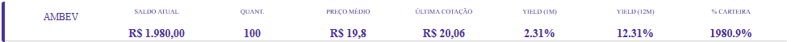

### FundsSetOfProducts.jsx
Coleção de FundsProduct.<br>

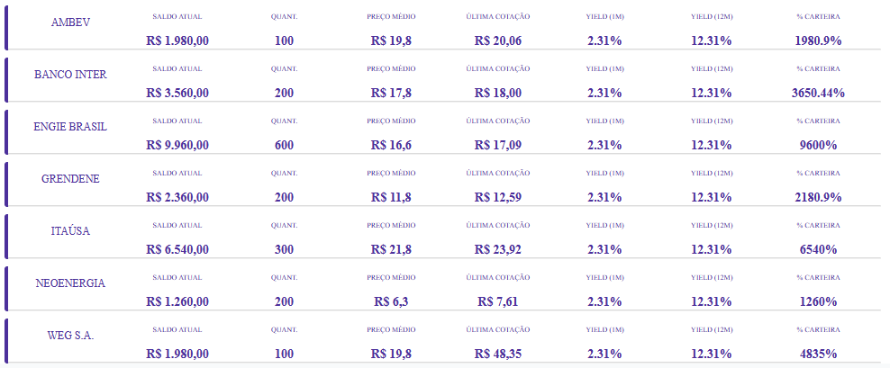

### FundsNavBar.jsx
Além da utilização do componente anterior (FundsSetOfProducts.jsx), foi criado o título da "página" e uma barra de
pesquisa de produtos.<br>

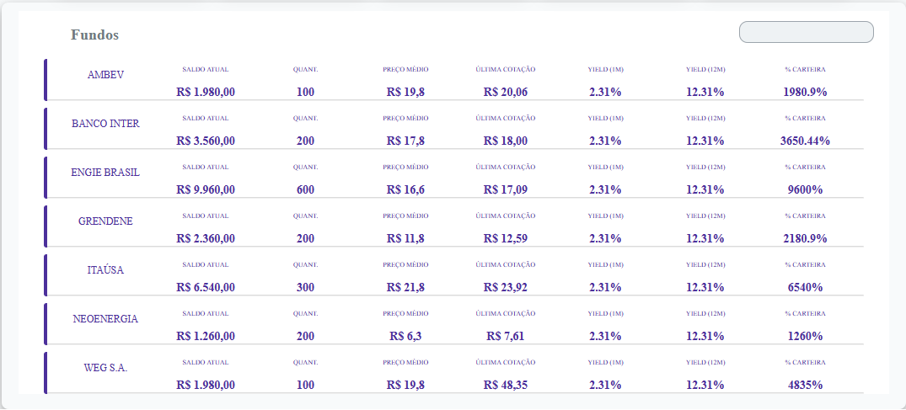

### StockClassButton.jsx
"botão" que aparece dentro da aba "Ações" - por isso o nome StockClassButton - e receberá seu nome e conteúdo
na classe StockClassSetOfButtons.jsx, já que é classe que irá criar a lista de botões.<br>

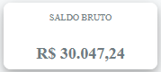

### StockClassSetOfButtons.jsx
Como comentado no componente anterior, é a coleção de StockClassButton.jsx e aqui serão passados as informações que
cada botão deve possuir.

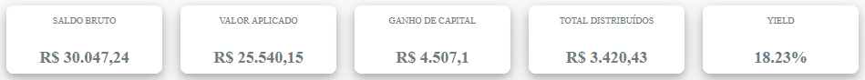

### AssetClassButton.jsx
Aba que fica no topo, como por exemplo a classe Ações.

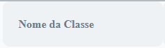

### AssetClassSetOfButtons.jsx
Coleção do componente anterior.

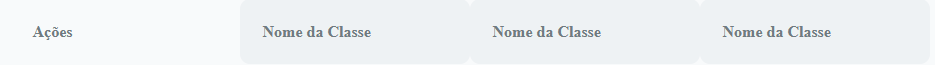

### AssetsWrapper.jsx
Container para AssetClassSetOfButtons, StockClassSetOfButtons e FundsNavBar.

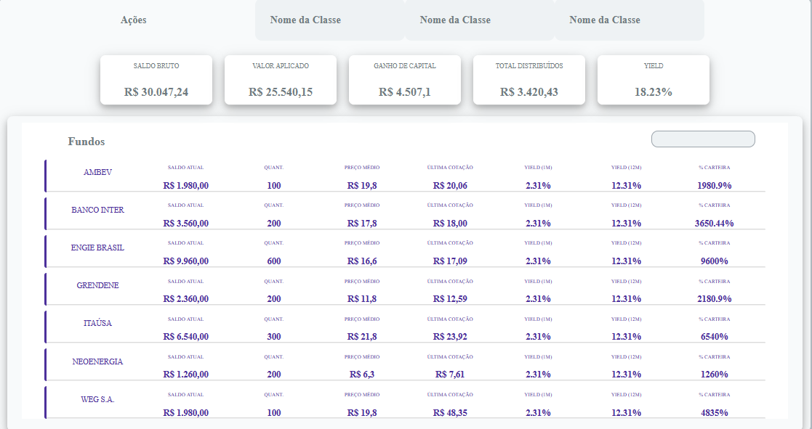

### AssetsWrapperSuper.jsx
Container para AssetsWrapper e o título "Análise por Classes de Ativos".

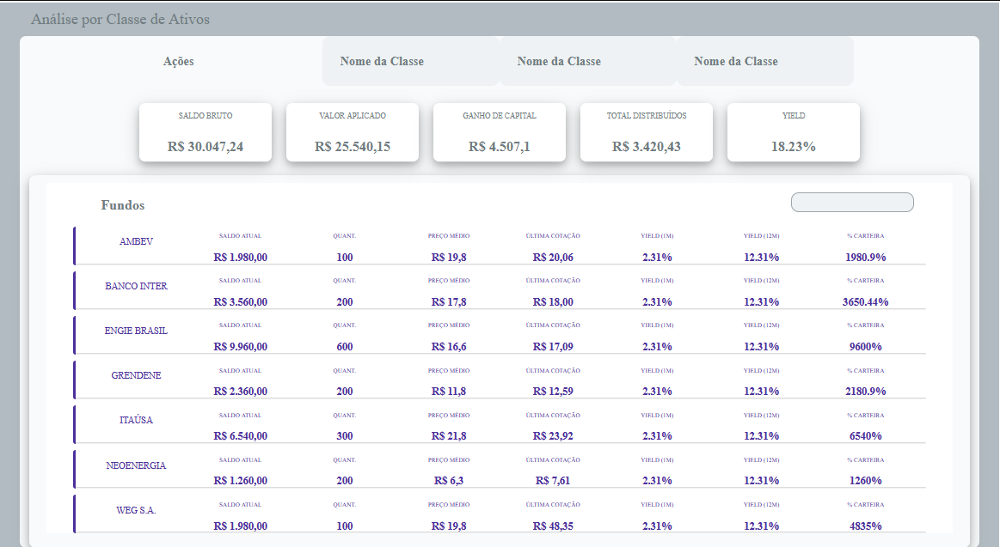

### SidebarButton.jsx
Um dos botões que compõem a barra lateral da aplicação.

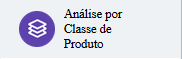

### SidebarSetOfButtons.jsx
Coleção de Sidebar Buttons. Barra lateral.

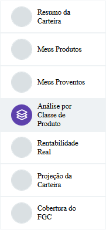

### Header.jsx
É como o nome diz, o header da aplicação.


### ApplicationWrapper.jsx
Container que envolve toda a aplicação.


