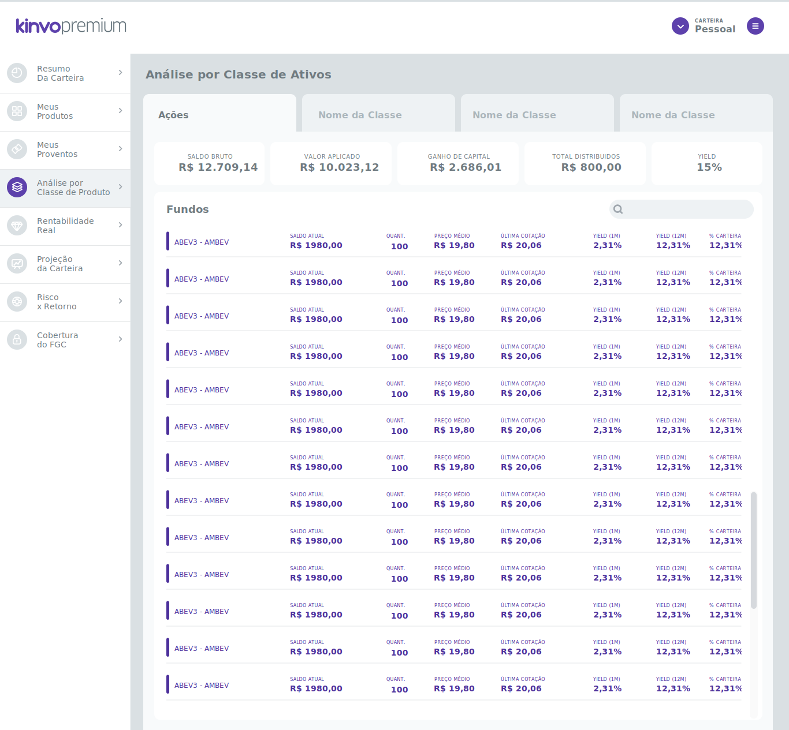

# Challenge Kinvo Front-End ReactJs &middot; 

> 

Front-end challenge for job vacancy at kinvo company using reactjs

## Installing / Getting started

A quick introduction of the minimal setup you need to get a hello world up &
running.

```shell
commands here
```

Here you should say what actually happens when you execute the code above.

## Developing

### Built With

List main libraries, frameworks used including versions:

- React: "^16.8.6"
- Axios: "^0.19.0"
- React-router-dom: "^5.0.1",
- Styled-components: "^4.3.2"
- React-icons: "^3.7.0",
- Classnames: "^2.2.6",
- Prop-types: "^15.7.2",

### Prerequisites

What is needed to set up the dev environment.

- [Yarn](https://yarnpkg.com/en/docs/install#windows-stable)
- [VS Code](https://code.visualstudio.com/)

### Setting up Dev

Clone the project and direct an application folder into ReactJS, then install the dependencies:

```shell
git clone https://github.com/gabrieljony/kinvo-front-end-test.git
cd kinvo-front-end-test/
cd kinvo-frontend/
yarn install
```

In this project no database and no services are consumed locally. The project consumes an external [API](https://ed87c2a9-bcc4-4e0c-8fd2-fefb9875b65b.mock.pstmn.io/getStockConsolidation), in which it needs no configuration.

### Building

If your project needs some additional steps for the developer to build the
project after some code changes, state them here. for example:

```shell
./configure
make
make install
```

Here again you should state what actually happens when the code above gets
executed.

### Deploying / Publishing

give instructions on how to build and release a new version
In case there's some step you have to take that publishes this project to a
server, this is the right time to state it.

```shell
packagemanager deploy your-project -s server.com -u username -p password
```

And again you'd need to tell what the previous code actually does.

## Versioning

We can maybe use [SemVer](http://semver.org/) for versioning. For the versions available, see the [link to tags on this repository](/tags).

## Configuration

Here you should write what are all of the configurations a user can enter when
using the project.

## Tests

Describe and show how to run the tests with code examples.
Explain what these tests test and why.

```shell
Give an example
```

## Style guide

Explain your code style and show how to check it.

## Api Reference

If the api is external, link to api documentation. If not describe your api including authentication methods as well as explaining all the endpoints with their required parameters.

## Database

Explaining what database (and version) has been used. Provide download links.
Documents your database design and schemas, relations etc...

## Licensing

State what the license is and how to find the text version of the license.

## Challenge


